<div align="center">

# 🎮 Billing Rental PS

**Aplikasi billing rental PlayStation lengkap — kasir, TV terkunci otomatis, F&B, booking, member, turnamen, laporan.**
Jalan di PC rental (offline-first) dan bisa disinkron ke server cloud.

[](https://github.com/deindr4/billing-rental-ps/releases/latest)


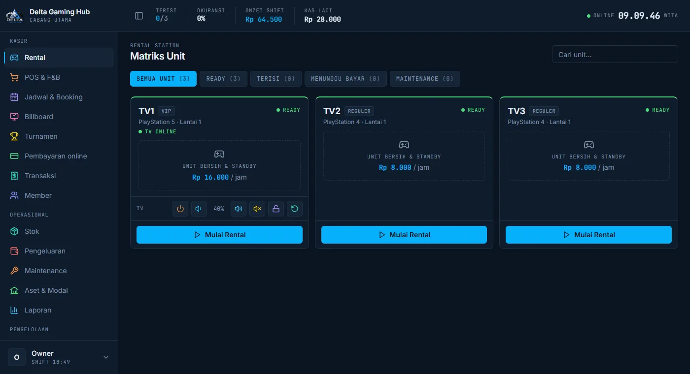

</div>

---

## Daftar isi

- [Kenapa aplikasi ini](#kenapa-aplikasi-ini)
- [Tampilan](#tampilan)
- [Fitur](#fitur)
- [Cara kerja](#cara-kerja)
- [Memasang](#memasang)
- [Update](#update)
- [Pengembangan](#pengembangan)
- [Dokumentasi](#dokumentasi)

---

## Kenapa aplikasi ini

| Masalah di rental | Solusi |
|---|---|
| Pelanggan main lewat waktu, kasir lupa mematikan | **TV terkunci sendiri** saat waktu habis — dihitung di TV, tetap jalan walau server / internet putus |
| Catatan manual, uang laci tidak cocok | Semua sesi, F&B & pembayaran tercatat per **shift kas**; selisih kas, pembatalan & aksi penting masuk **log audit** |
| Harus ke kasir untuk tambah waktu | Pelanggan **scan QRIS di TV**, bayar sendiri, TV terbuka otomatis |
| PC rental mati = semua berhenti | TV pindah otomatis ke **server cloud** & kembali ke lokal saat hidup lagi |
| Pasang server itu ribet | **Satu installer `.exe`** — PHP, Apache, MariaDB, WhatsApp, Cloudflare Tunnel ikut terpasang sebagai layanan Windows |

---

## Tampilan

### Kasir (tablet / PC / HP)

<table>
  <tr>
    <td width="50%">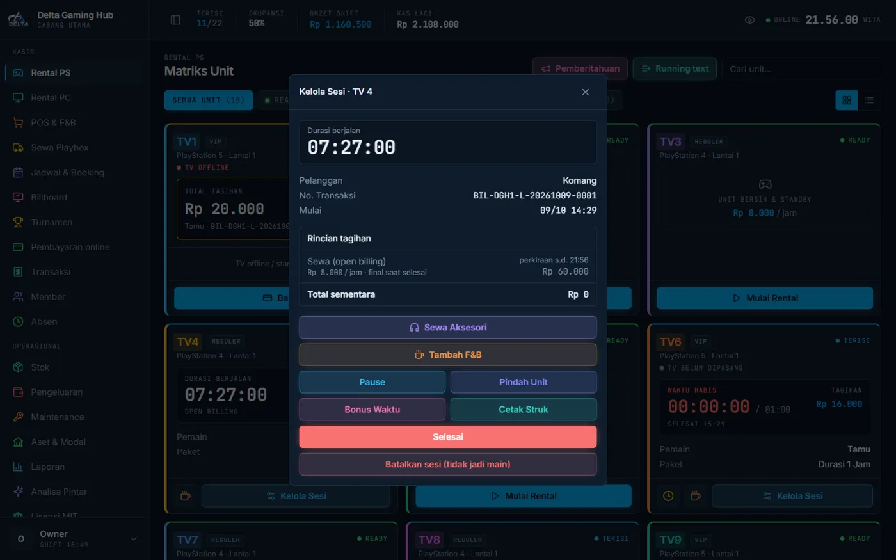<br><sub><b>Kelola sesi</b> — tambah waktu, F&B, pause, pindah unit, bonus waktu, struk</sub></td>
    <td width="50%">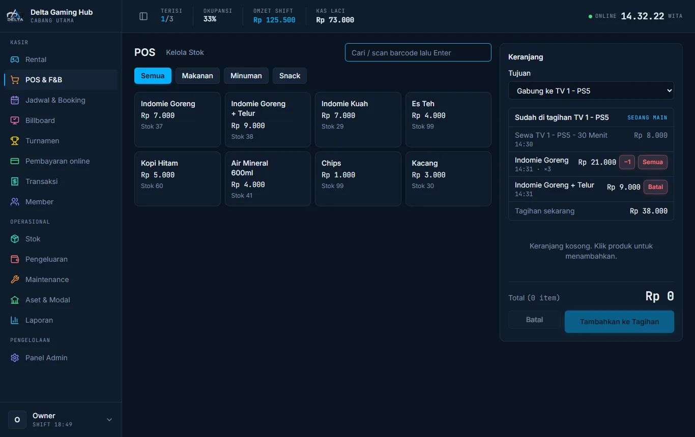<br><sub><b>POS F&B</b> — gabung ke tagihan unit, batalkan salah order (−1 / semua)</sub></td>
  </tr>
  <tr>
    <td>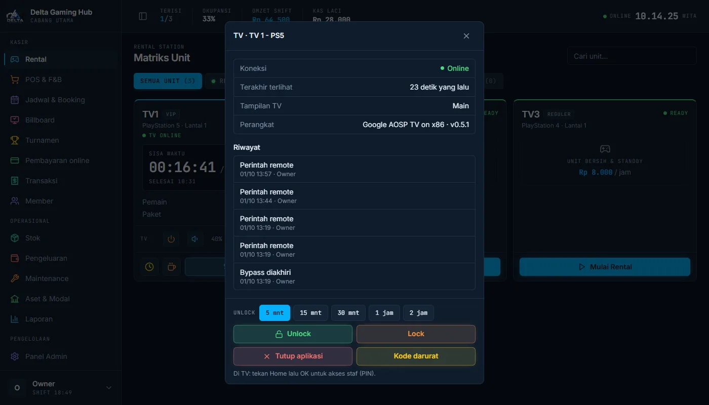<br><sub><b>Kelola TV</b> — unlock / lock, bypass berdurasi, kode darurat, riwayat</sub></td>
    <td>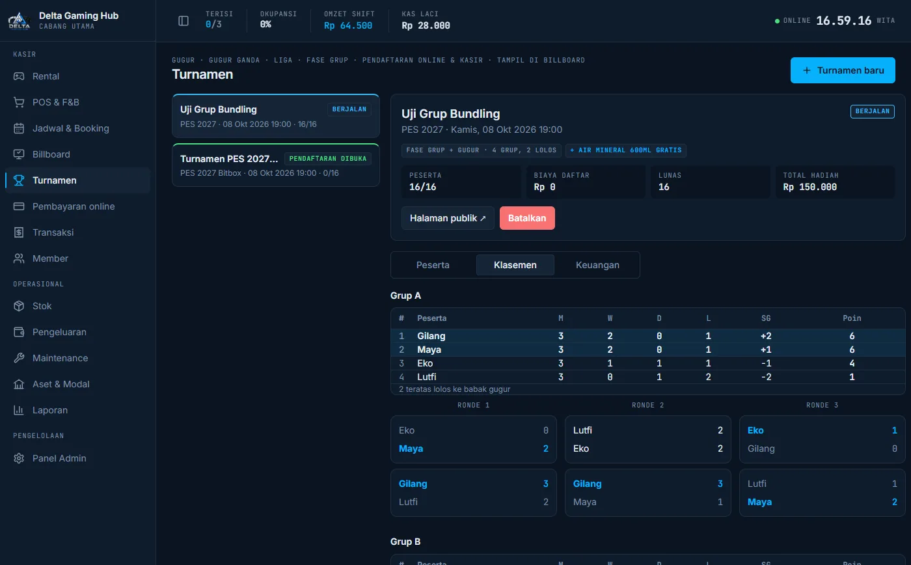<br><sub><b>Turnamen</b> — gugur, gugur ganda, liga, fase grup + klasemen</sub></td>
  </tr>
  <tr>
    <td>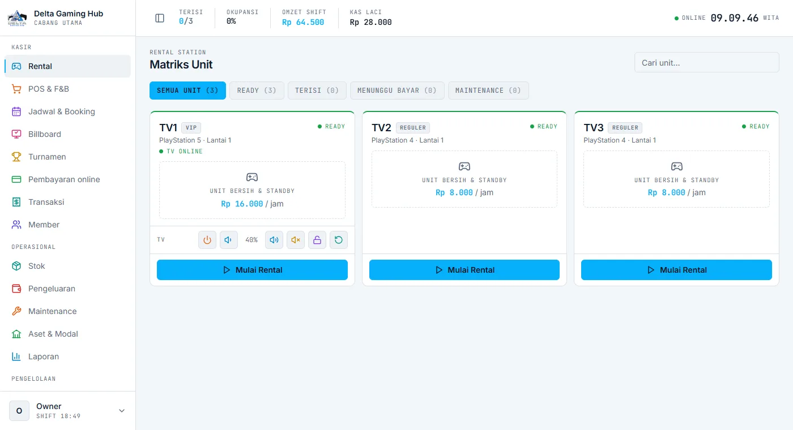<br><sub>Mode terang · ikon & tombol berwarna per fungsi</sub></td>
    <td align="center">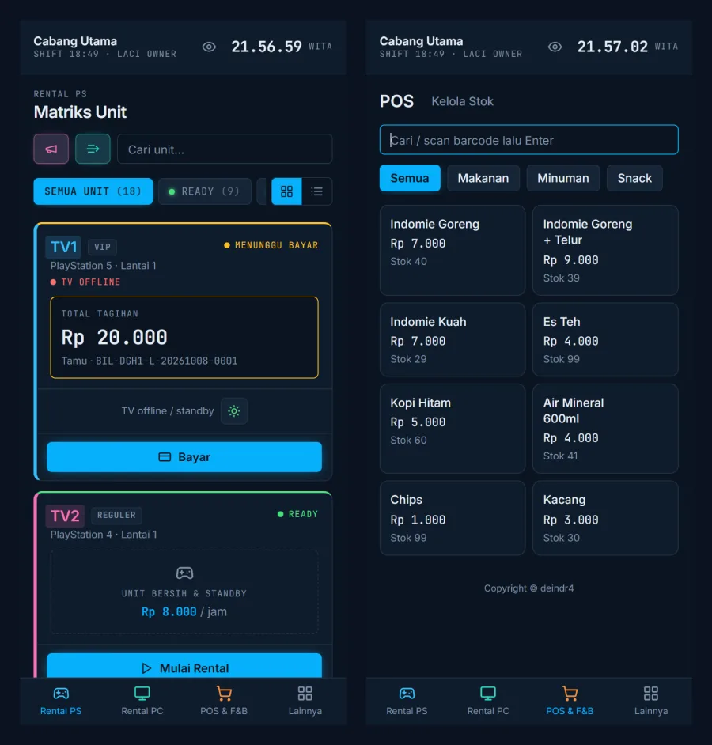<br><sub>Responsif di HP: matriks unit & POS</sub></td>
  </tr>
</table>

### TV (APK TV Agent untuk Android TV / Google TV)

<table>
  <tr>
    <td width="50%">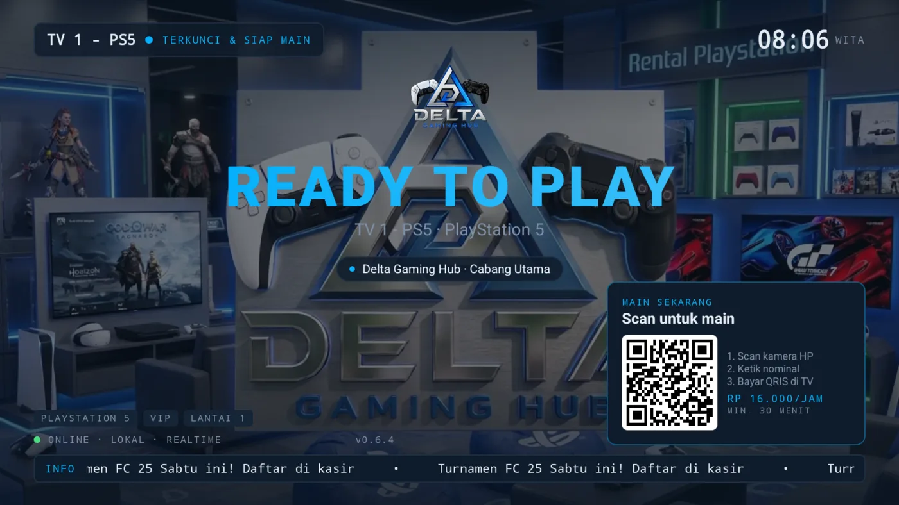<br><sub><b>Layar kunci</b> — logo & wallpaper rental, QRIS "scan untuk main", running text</sub></td>
    <td width="50%">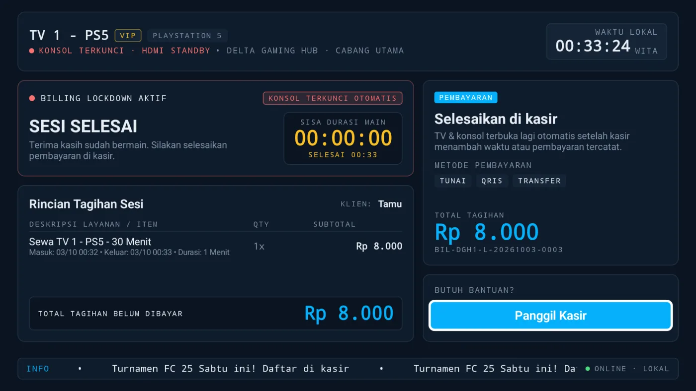<br><sub><b>Sesi selesai</b> — rincian tagihan, tombol panggil kasir</sub></td>
  </tr>
  <tr>
    <td>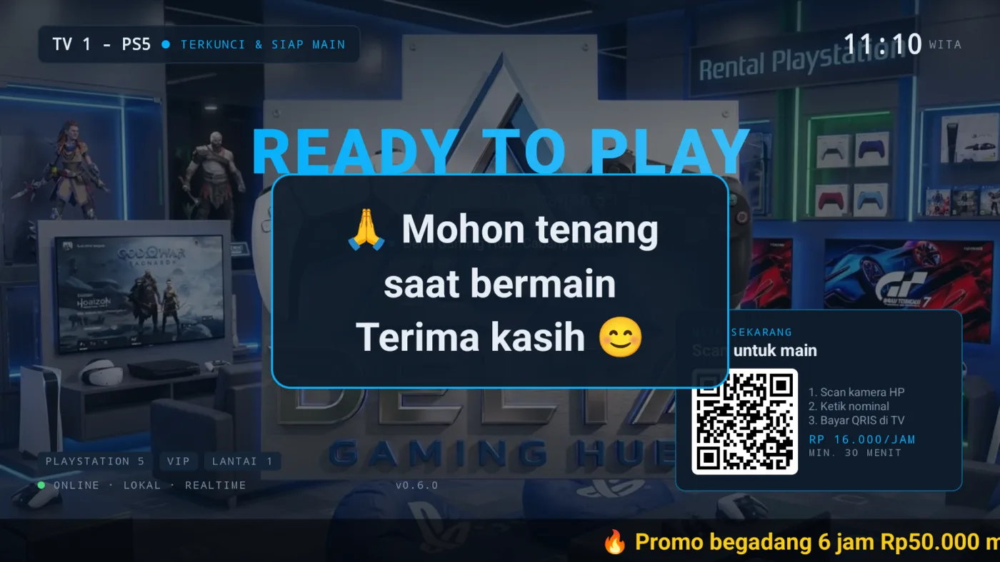<br><sub><b>Pemberitahuan</b> dari kasir di tengah layar + running text promo</sub></td>
    <td><br><sub><b>Transisi logo</b> saat mulai & selesai main</sub></td>
  </tr>
</table>

<p align="center">
  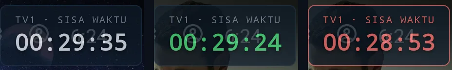<br>
  <sub><b>Timer melayang di atas game</b> — warna, ukuran & kepekatan diatur admin; otomatis merah & berkedip + bunyi saat hampir habis</sub>
</p>

### Admin & halaman publik

<table>
  <tr>
    <td width="50%">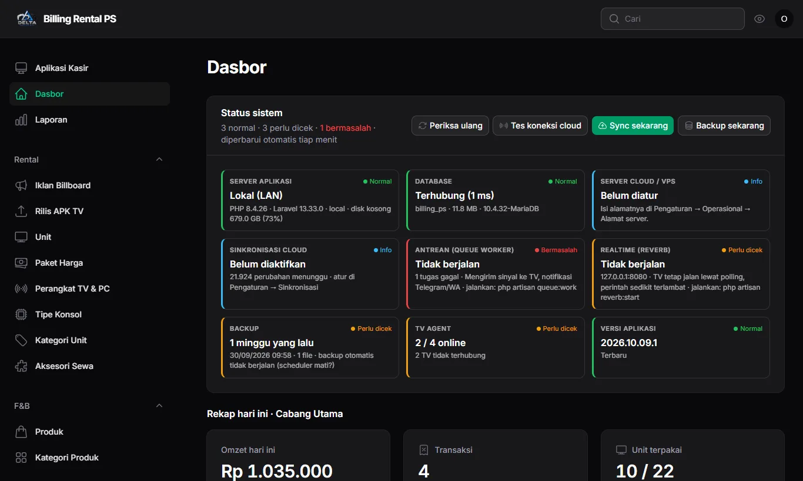<br><sub><b>Dasbor</b> — status server, database, sync, antrean, backup, TV & versi aplikasi</sub></td>
    <td width="50%">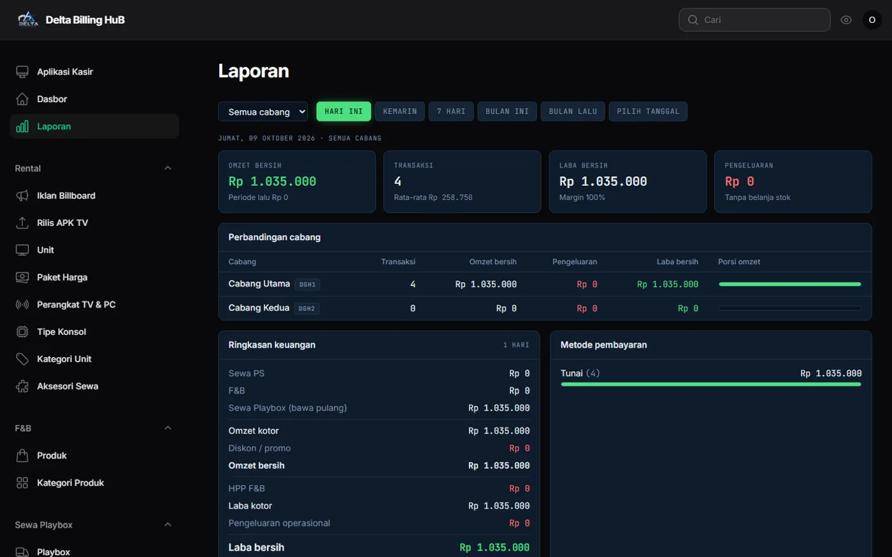<br><sub><b>Laporan</b> — omzet, laba, HPP, metode bayar, perbandingan cabang</sub></td>
  </tr>
  <tr>
    <td>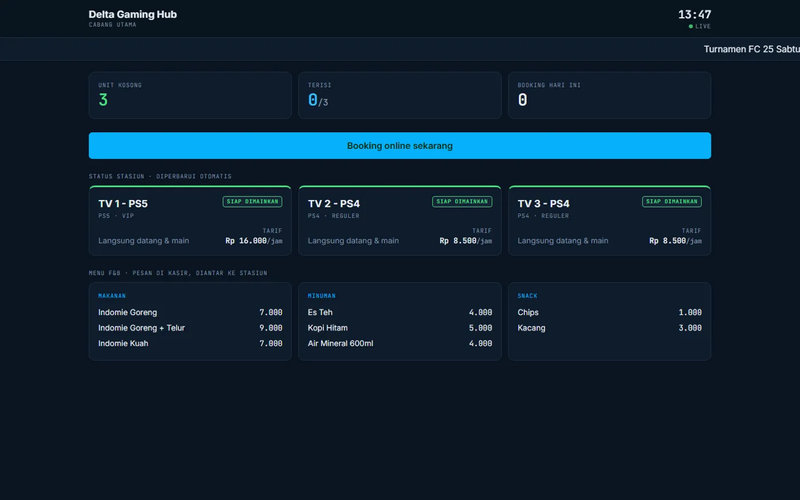<br><sub><b>Billboard</b> — status stasiun langsung, menu F&B, promo</sub></td>
    <td align="center">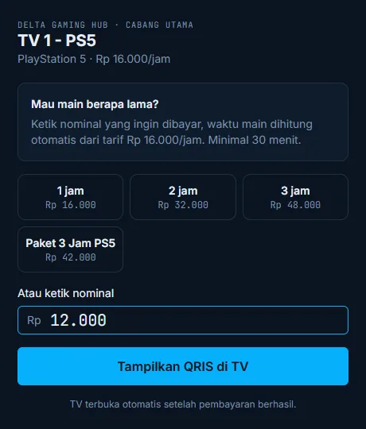<br><sub><b>Bayar mandiri</b> dari HP pelanggan → QRIS tampil di TV</sub></td>
  </tr>
</table>

---

## Fitur

<details open>
<summary><b>🕹️ Rental & sesi</b></summary>

- Matriks unit realtime: ready, terisi, menunggu bayar, maintenance — sisa waktu, tagihan & status TV per kartu.
- Mode **paket / durasi** (hitung mundur) dan **open billing** (blok menit, minimal tagih, toleransi, pembulatan).
- **Waktu pilih game** tidak ditagih, tambah waktu (bayar / gratis dengan PIN), **bonus waktu** kompensasi, pause & resume.
- **Pindah unit** tanpa kehilangan tagihan, **batal tambah waktu** & **batal sesi** (salah pencet / tidak jadi main).
- Satu TV beberapa konsol: nama per **HDMI** (HDMI 1 = PS3, HDMI 2 = PS4 …), kasir memilih / memindah HDMI.
- Tarif per tipe konsol, kategori unit (VIP / reguler), paket harga & aturan harga.
</details>

<details>
<summary><b>📺 TV Agent (APK Android TV)</b></summary>

- TV **terkunci** di luar sesi; saat main pindah otomatis ke HDMI PS, saat habis kembali terkunci.
- Timer dihitung **di TV** (aman saat offline), peringatan sisa waktu: angka merah, berkedip, bunyi.
- Remote dari kasir: volume, matikan / **bangunkan** layar, restart, pindah HDMI, pemberitahuan, running text.
- **Bypass** berdurasi dengan PIN, **kode darurat** offline (TOTP), akses staf (Home → OK → PIN).
- **Failover** lokal ↔ cloud, info versi & **ping server** di bawah timer, kunci remote saat main.
- Mode kiosk (jadi layar utama), update APK dari server (push ke semua TV, rollback).
</details>

<details>
<summary><b>🍜 POS, stok & keuangan</b></summary>

- POS F&B: jual langsung atau **gabung ke tagihan unit**, scan barcode, batal salah order (stok kembali).
- Stok per cabang dengan HPP rata-rata, stok masuk, **opname**, mutasi.
- **Shift kas**: buka / tutup kas, hitung pecahan, selisih kas tercatat; pengeluaran dengan batas & PIN.
- Pembayaran: tunai, QRIS statis (nominal otomatis), transfer, saldo member, campuran.
- Struk printer Bluetooth (RawBT, 58 / 80 mm) & kirim struk lewat WhatsApp.
- Aset & modal, maintenance unit, laporan omzet / laba / HPP / metode bayar / perbandingan cabang.
</details>

<details>
<summary><b>👥 Member, booking & turnamen</b></summary>

- Member: saldo top-up (bonus), **poin**, **stamp** (hadiah menit main), **tier** dengan diskon otomatis.
- **Booking online** dari HP (portal per cabang), jadwal kasir, toleransi terlambat, tanda "tidak datang".
- **Antrean lounge**.
- **Turnamen**: gugur, gugur ganda, liga, fase grup; pendaftaran online & kasir, bundling F&B, keuangan & hadiah, bagan publik.
- **Billboard** publik (status stasiun, menu F&B, promo) & iklan dengan masa tayang.
</details>

<details>
<summary><b>💳 Pembayaran online & bayar mandiri</b></summary>

- Payment gateway: **Tripay, Midtrans, Duitku, iPaymu, DOKU, Winpay**.
- Pelanggan scan QR di TV → ketik nominal di HP → bayar QRIS → **TV terbuka otomatis** (durasi = nominal ÷ tarif).
</details>

<details>
<summary><b>🔐 Akses, keamanan & sistem</b></summary>

- Multi-tenant & multi-cabang; role **Super Admin, Owner, Supervisor, Kasir, Teknisi** + PIN persetujuan.
- Log audit & anomali (batal transaksi, waktu gratis, bypass, selisih kas, batal F&B …).
- Batas login (3× salah per IP → blokir 15 menit), header keamanan, sudah melalui pentest.
- **Sinkronisasi lokal ↔ cloud** dua arah (trigger database, token per server).
- Backup harian otomatis + pulihkan (juga saat instal di PC baru).
- Laporan otomatis ke **Telegram** & **WhatsApp** (layanan WA bawaan, login QR).
- **Cloudflare Tunnel** dari admin: buka aplikasi PC rental lewat domain HTTPS tanpa membuka port router.
- **Cek update** dari GitHub Releases + catatan fitur di admin.
</details>

---

## Cara kerja

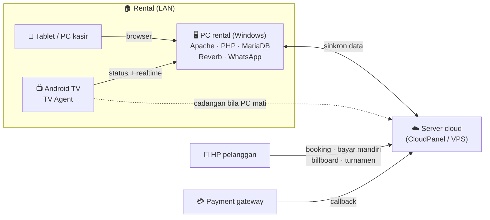

- **Server lokal** di PC rental: kasir & TV tetap jalan walau internet putus.
- **Server cloud** (opsional): halaman publik, pembayaran online, cadangan TV, akses owner dari mana saja.
- TV memakai server lokal; bila tidak menjawab ±30 detik pindah ke cloud, dan kembali ke lokal saat hidup lagi.

---

## Memasang

### PC rental (Windows 10 / 11, 64-bit)

1. Unduh **`BillingPS-Setup-<versi>.exe`** dari [Releases](https://github.com/deindr4/billing-rental-ps/releases/latest).
2. Jalankan → pilih **Pasang baru** atau **Pulihkan dari file backup** (pindah PC).
3. Isi nama rental, akun owner, zona waktu → tunggu beberapa menit.
4. Selesai: **data login** ditampilkan, aplikasi terbuka di `http://localhost` dan `http://IP-PC` untuk tablet & TV.

Semua komponen (PHP 8.4, Apache, MariaDB, Node.js untuk WhatsApp, cloudflared) terpasang sebagai **layanan Windows**
yang menyala sendiri, firewall dibuka hanya untuk jaringan lokal. Panduan: [docs/installer.md](docs/installer.md).

### TV

Di TV buka `http://IP-PC/apk` → pasang **TV Agent** → isi alamat server → masukkan kode pairing di Admin → Perangkat TV.
Izin & mode kiosk: [tv-agent/README.md](tv-agent/README.md).

### Server cloud (opsional)

Unggah **`BillingPS-cloud-<versi>.tar.gz`** ke CloudPanel / VPS — langkah lengkap di [docs/cloudpanel.md](docs/cloudpanel.md)
(atau shared hosting tanpa realtime: [docs/hosting.md](docs/hosting.md)).

---

## Update

Setiap pemasangan memeriksa [rilis terbaru](https://github.com/deindr4/billing-rental-ps/releases) tiap 6 jam.
Bila ada versi baru, admin melihat catatan fiturnya di **Pemeliharaan sistem → Update aplikasi** beserta tombol unduh
file yang cocok (`.exe` untuk PC Windows, `.tar.gz` untuk cloud). Installer otomatis backup database sebelum update —
data & pengaturan tetap. Detail: [docs/update-aplikasi.md](docs/update-aplikasi.md).

---

## Pengembangan

**Stack:** Laravel 13 · Livewire 4 · Filament 5 · Spatie Permission (teams) · Laravel Reverb · MariaDB / MySQL ·
Tailwind · Vite · APK Kotlin + Jetpack Compose (`tv-agent/`) · Node.js + Baileys (`whatsapp-service/`).

```bash
composer install && npm install && npm run build
cp .env.example .env && php artisan key:generate
php artisan migrate --seed          # data demo: owner@billing.test / admin@billing.test, password "password"
php artisan serve                   # http://127.0.0.1:8000
php artisan reverb:start            # realtime TV
php artisan queue:work              # antrean (notifikasi, sinyal TV)
php artisan schedule:work           # pembayaran online, sync, backup, cek update
php artisan test                    # tes otomatis
```

| Perintah | Fungsi |
|---|---|
| `php artisan superadmin` | Buat / reset super admin |
| `php artisan sync` | Sinkronisasi lokal ↔ cloud (jalankan, kirim-ulang, tarik-ulang, pasang-trigger, token) |
| `php artisan backup:buat` / `backup:pulihkan` | Backup & pulihkan database + unggahan |
| `php artisan update:cek` | Cek versi baru di GitHub |
| `php artisan gambar:kompres` | Kompres foto / logo lama ke WebP |

**APK TV:** `cd tv-agent && ./gradlew assembleDebug` · **Installer:** `installer\build.ps1` ·
**Rilis:** `installer\rilis.ps1` ([docs/update-aplikasi.md](docs/update-aplikasi.md)).

```
app/                 Laravel: Livewire kasir, Filament admin, layanan billing, TV, sinkron, gateway
resources/views/     Blade (kasir, admin, publik)        tests/   tes fitur
tv-agent/            APK Android TV (Kotlin + Compose)    whatsapp-service/   layanan WA (Node.js)
installer/           Installer Windows (Inno Setup + PowerShell), build & rilis
docs/                Dokumentasi & changelog              docs/desain/   desain Stitch (acuan tampilan)
```

---

## Dokumentasi

| Dokumen | Isi |
|---|---|
| [docs/installer.md](docs/installer.md) | Installer Windows: pasang, pulihkan backup, update, Cloudflare Tunnel, WhatsApp, uninstall, build |
| [docs/update-aplikasi.md](docs/update-aplikasi.md) | Cek update dari GitHub & menerbitkan rilis |
| [docs/cloudpanel.md](docs/cloudpanel.md) | Server cloud di CloudPanel (Nginx, Cloudflare, cron, supervisor, update) |
| [docs/hosting.md](docs/hosting.md) | Server cloud di shared hosting / cPanel (tanpa realtime TV) |
| [docs/server-publik.md](docs/server-publik.md) | Server publik, Cloudflare, `.env` produksi, checklist |
| [docs/sinkron.md](docs/sinkron.md) | Sinkronisasi server lokal ↔ cloud |
| [docs/hak-akses.md](docs/hak-akses.md) | Akses Super Admin, Owner, Supervisor, Kasir, Teknisi |
| [docs/pembayaran-online.md](docs/pembayaran-online.md) | Payment gateway & bayar mandiri QRIS di TV |
| [docs/turnamen.md](docs/turnamen.md) | Format turnamen, bundling F&B, keuangan & hadiah |
| [docs/tv-agent-api.md](docs/tv-agent-api.md) | Kontrak API server ↔ TV Agent |
| [docs/rilis-apk.md](docs/rilis-apk.md) | Rilis, push update & rollback APK TV |
| [docs/pentest-2026-10-02.md](docs/pentest-2026-10-02.md) | Hasil uji keamanan & checklist |
| [docs/desain/README.md](docs/desain/README.md) | Desain Stitch (acuan semua tampilan) |
| [docs/changelogbill.txt](docs/changelogbill.txt) · [docs/changelog.txt](docs/changelog.txt) | Catatan perubahan aplikasi & APK TV |
